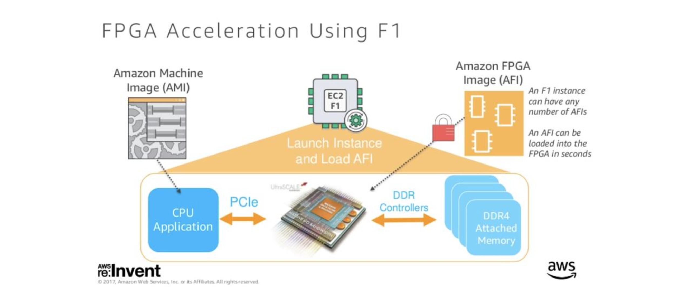
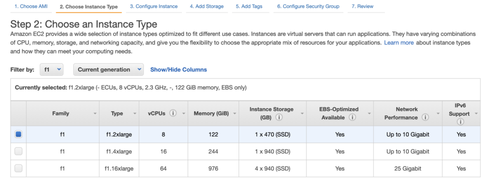
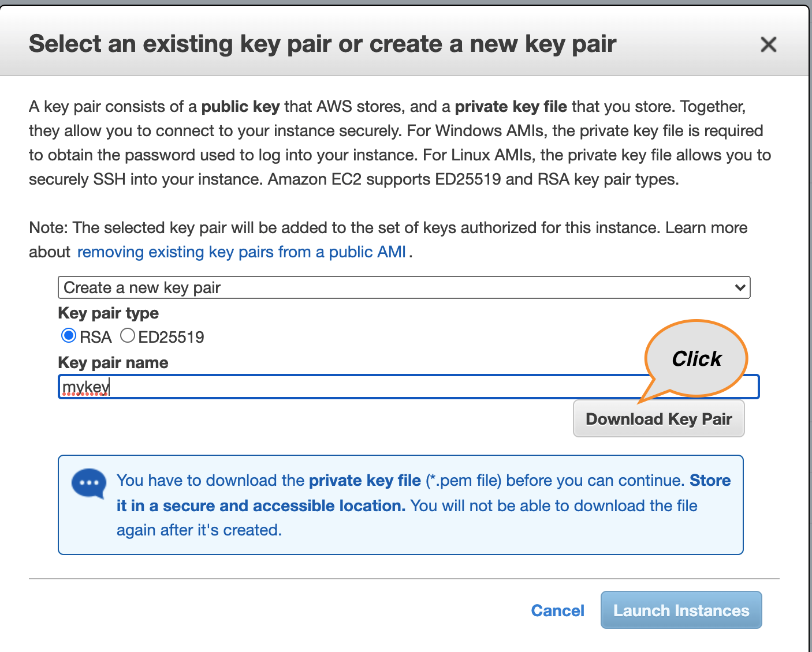

**Table Of Contents**

[1 CREATING AN INSTANCE WITH PULSAR-VMAF AMI](#1-creating-an-instance-with-pulsar-vmaf-ami)<br/>
[1 HOW TO EVALUATE](#2-how-to-evaluate)<br/>

---

<br/>

<br/>

# 1 Creating an instance with Pulsar-VMAF AMI
## PROCEDURE

### Step 1. Choose the AMI we shared
- Click “Launch instance” in EC2 console
- Type "Pulsar-VMAF" in the search box and select it.

### Step 2. Choose f1.2xlarge instance
choose f1.2xlarge
<br/>

<br/>

### Step 3. Review and launch the instance
- Create a private key if you have no existing key and download it.
<br/>

<br/>
- Click "Launch Instances"

### Step 4. Connect to your instance

```bash
chmod 600 <private_key_path>
ssh -i <private_key_path> ec2-user@<ip_address>
```
Then you can see the following messages:
```

 _______  __   __  ___      _______  _______  ______           __   __  __   __  _______  _______
|       ||  | |  ||   |    |       ||   _   ||    _ |         |  | |  ||  |_|  ||   _   ||       |
|    _  ||  | |  ||   |    |  _____||  |_|  ||   | ||   ____  |  |_|  ||       ||  |_|  ||    ___|
|   |_| ||  |_|  ||   |    | |_____ |       ||   |_||_ |____| |       ||       ||       ||   |___
|    ___||       ||   |___ |_____  ||       ||    __  |       |       ||       ||       ||    ___|
|   |    |       ||       | _____| ||   _   ||   |  | |        |     | | ||_|| ||   _   ||   |
|___|    |_______||_______||_______||__| |__||___|  |_|         |___|  |_|   |_||__| |__||___|

                                                                             https://blue-dot.io
                                                                                info@blue-dot.io

#### HOWTO ####
ffmpeg -i 2160_dst.mp4 -vsync 0 -i 2160.mp4 -vsync 0 -lavfi libbdvmaf=model_path=/etc/bluedot/libbdvmaf/vmaf_4k_v0.6.1.json:kernel_path=/etc/bluedot/libbdvmaf/f1_binary.xclbin:log_path=test.xml -f null -
You can run two ffmpegs in a f1.2xlarge, four ffmpegs in a f1.4xlarge
```
The list of files is as follows at the initial connection:
- 2160_dst.mp4 - distorted video of which quality is to be measured, playback time: 6sec @ 25fps
- 2160.mp4 - reference video
- /etc/bluedot/libbdvmaf/vmaf_4k_v0.6.1.json, /etc/bluedot/libbdvmaf/vmaf_v0.6.1.json - VMAF models
    + Refer to [https://github.com/Netflix/vmaf/blob/master/resource/doc/models.md](https://github.com/Netflix/vmaf/blob/master/resource/doc/models.md) for more details.
- /etc/bluedot/libbdvmaf/f1_binary.xclbin - AWS FPGA binary

# 2 How to evaluate
In one f1.2xlarge instance, two kernels are instantiated. The following examples show how to run one kernel and two kernels, respectively.  
In the AMI installed, two video bistreams, 2160.mp4 and 2160_dst.mp4, are provided for examples.
#### Measuring VMAF of compressed videos using one kernel
```bash
ffmpeg -i 2160_dst.mp4 -vsync 0 -i 2160.mp4 -vsync 0 -lavfi libbdvmaf=model_path=/etc/bluedot/libbdvmaf/vmaf_4k_v0.6.1.json:kernel_path=//etc/bluedot/libbdvmaf/f1_binary.xclbin -f null -
```
You can find the VMAF score as following:
```bash
frame=150 fps= 35 q=-0.0 Lsize=N/A time=00:00:06.00 bitrate=N/A speed=1.38x
video:79kB audio:0kB subtitle:0kB other streams:0kB global headers:0kB muxing overhead: unknown
[Parsed_libbdvmaf_0 @ 0x759d0c0] Total number of processed frames: 150
[Parsed_libbdvmaf_0 @ 0x759d0c0] AVG. VMAF Score: 85.663229
```
If you want to output scores of models per frame to a file, use "log_path" and "log_fmt" options as the following:
```bash
ffmpeg -i 2160_dst.mp4 -vsync 0 -i 2160.mp4 -vsync 0 -lavfi libbdvmaf=model_path=/etc/bluedot/libbdvmaf/vmaf_4k_v0.6.1.json:kernel_path=/etc/bluedot/libbdvmaf/f1_binary.xclbin:log_path=log.json:log_fmt=json -f null -
```
The supported output formats are json, xml and csv.

The following is an example of output with "log_fmt=json" option.
```
{
  "version": "2.2.0 based H/W",
  "frames": [
    {
      "frameNum": 0,
      "metrics": {
        "integer_adm2": 1.000000,
        "integer_adm_scale0": 1.000000,
        "integer_adm_scale1": 1.000000,
        "integer_adm_scale2": 1.000000,
        "integer_adm_scale3": 1.000000,
        "integer_motion2": 0.000000,
        "integer_motion": 0.000000,
        "integer_vif_scale0": 1.000000,
        "integer_vif_scale1": 1.000000,
        "integer_vif_scale2": 1.000000,
        "integer_vif_scale3": 1.000000,
        "vmaf": 100.000000
      }

...

  "pooled_metrics": {
    "integer_adm2": {
      "min": 0.858771,
      "max": 1.062500,
      "mean": 0.954343,
      "harmonic_mean": 0.953602
    },
    "integer_adm_scale0": {
      "min": 0.979701,
      "max": 1.023748,
      "mean": 0.999715,
      "harmonic_mean": 0.999673
    },
    "integer_adm_scale1": {
      "min": 0.915208,
      "max": 1.059503,
      "mean": 0.973407,
      "harmonic_mean": 0.972973
    },
...
```

---
**Note**
1. When you specify a reference and a distorted video in ffmpeg command line options, please place the
distorted video first. It’s a requirement of ffmpeg.
2. For the first run after your connection to the instance, a little bit lower fps could be reported due to
loading time of AFI(Amazon FPGA Image) into FPGA. The AFI is not loaded for the next runs.

---
#### Measuring VMAF of raw videos using one kernel
The following example shows how to convert a compressed video to a raw video in YUV format.
```bash
ffmpeg -i 2160.mp4 2160.yuv
ffmpeg -i 2160_dst.mp4 2160_dst.yuv
```
Run the following command to measure VMAF score of those raw videos.   
```bash
ffmpeg -pix_fmt yuv420p -s 3840x2160 -i 2160_dst.yuv -pix_fmt yuv420p -s 3840x2160 -i 2160.yuv -lavfi libbdvmaf=model_path=/etc/bluedot/libbdvmaf/vmaf_4k_v0.6.1.json:kernel_path=/etc/bluedot/libbdvmaf/f1_binary.xclbin -f null -
```
The same score as the case of compressed videos is reported, and the speed is a little bit better due to less computation load on the CPUs.
#### Running two kernels
```bash
ffmpeg -i 2160_dst.mp4 -vsync 0 -i 2160.mp4 -vsync 0 -lavfi libbdvmaf=model_path=/etc/bluedot/libbdvmaf/vmaf_4k_v0.6.1.json:kernel_path=/etc/bluedot/libbdvmaf/f1_binary.xclbin -f null -
ffmpeg -i 2160_dst.mp4 -vsync 0 -i 2160.mp4 -vsync 0 -lavfi libbdvmaf=model_path=/etc/bluedot/libbdvmaf/vmaf_4k_v0.6.1.json:kernel_path=/etc/bluedot/libbdvmaf/f1_binary.xclbin -f null -
```
